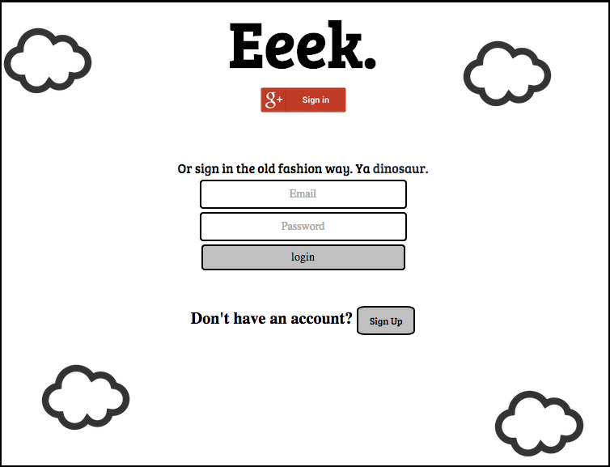

EeekApp
=======

Suicide Prevention App

https://eeek.herokuapp.com

Eeek is an application geared towards giving users the ability to build a support system for themselves for anxiety attacks and depressive episodes, with an ultimate goal of preventing suicide attempts. 

Eeek runs Rails 4.1.8, uses S3 Amazon Web Services for production level file storage through CarrierWave, a MySQL database in development and Posgress for production, and user authentication with Devise. Eeek is thoroughly tested with RSpec.  
